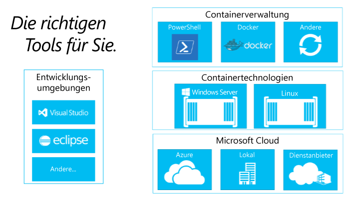

# Informationen zu Erstellen von Containerökosystemen

Um zu verstehen, warum das Erstellen eines Containerökosystems so wichtig ist, sehen wir uns zunächst seine Komponenten an.

## Komponenten eines Containerökosystems

Windows-Container sind eine wichtige Komponente eines großen Containerökosystems. Wir arbeiten mit der gesamten Branche zusammen, um Entwicklern Optionen auf allen Ebenen des Lösungsstapels zu bieten.

Das Containerökosystem bietet Methoden zum Verwalten, Freigeben und Entwickeln von in Containern ausgeführten Apps.

Microsoft möchte bei der Entwicklung dieser Apps der nächsten Generation Entwicklern mehr Optionen und Produktivität bieten. Unser Ziel ist das Steigern der Entwicklerproduktivität, was bedeutet, dass Anwendungen für beliebige Microsoft-Clouds geschrieben werden können, ohne dass Code geändert, neu geschrieben oder neu konfiguriert werden muss.

Microsoft setzt sich für ein offenes Ökosystem ein und befürwortet solche Systeme. Wir unterstützen aktiv die Kombination mehrerer wichtiger Ökosysteme für Entwickler (z. B. von Windows und Linux), um Innovationen voranzutreiben.

In den nächsten Monaten werden wir weitere Informationen zu zusätzliche Partnern in diesem sich entwickelnden Ökosystem veröffentlichen.